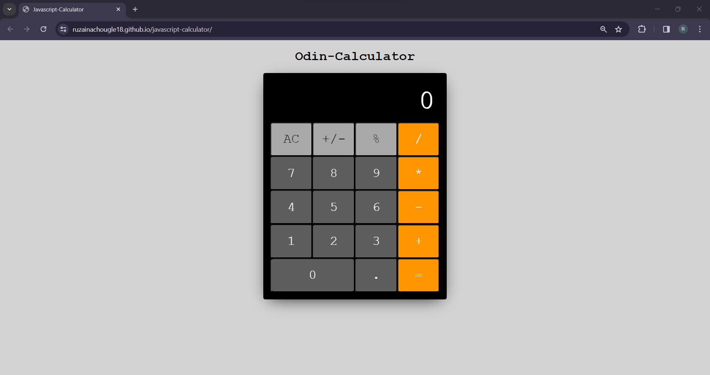

# javascript-calculator
Created this simple calculator using HTML, CSS, and Javascript &amp; completed Odin Foundations.

<a href="https://ruzainachougle18.github.io/javascript-calculator/" target="_blank">Live Link</a>

### Technologies used: 
* JavaScript
* HTML
* CSS

### Tools:
* Visual Studio Code
* Git
* GitHub
